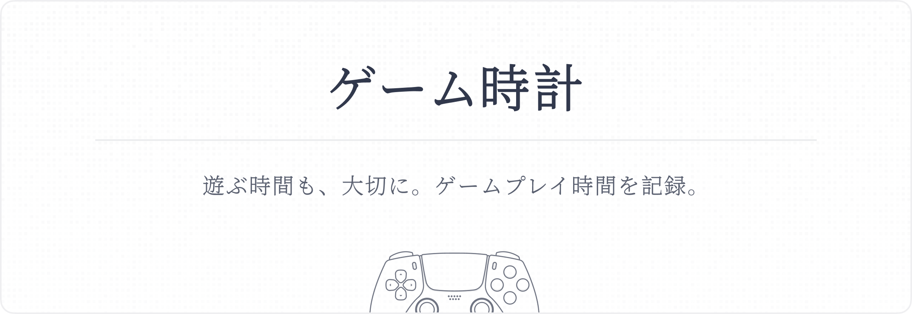

<p align="center">
  
  <br />
  <p align="center">
    English |
    <a href="./README.zh.md">中文</a>
  </p>
  <br />
</p>

## 📖 Introduction

Use ゲーム時計 to track and record your PSN gaming time.

With third-party API support, the application automatically retrieves current game status and playtime, presenting them in chart form.

## ✨ Features

- Automatically track and record PSN gaming time for specified users
- Visual representation of gaming statistics (in development)
- Export historical game records in JSON format
- One-click deployment and quick Docker container launch

## 🚀 Deployment

### Docker

Make sure you have Docker installed, then run the following command to start the container:

```
docker run -d \
  --name=game-tracker \
  -p 4200:4200 \
  -e JWT_SECRET=your_secret_key_here \
  -v $(pwd)/data:/app/data \
  --restart unless-stopped \
  nuthx/game-tracker:latest
```

Or deploy using Docker Compose:

```
version: "3.8"

services:
  app:
    image: nuthx/game-tracker:latest
    ports:
      - "4200:4200"
    restart: unless-stopped
    environment:
      - JWT_SECRET=your_secret_key_here
    volumes:
      - ./data:/app/data
```

Whichever method you choose, please fill in a random string for JWT_SECRET, preferably 16 characters or more.

### Local Deployment

Clone the repository and install the necessary dependencies:

```
git clone https://github.com/yourusername/game-tracker.git
cd game-tracker
npm install
```

Create a new environment variable file `.env` and configure JWT_SECRET with a random string of 16 or more characters:

```
JWT_SECRET=your_secret_key_here
```

Finally, initialize the database and start the application:

```
npx prisma migrate deploy
npm run build
npm run start
```

## 🎮 Usage

### 1. Obtaining NPSSO

Visit [PlayStation](https://www.playstation.com/) in your browser, click the "Login" button, and sign in with your PSN account.

Open [https://ca.account.sony.com/api/v1/ssocookie](https://ca.account.sony.com/api/v1/ssocookie) in a new tab. The browser will return a JSON response in the following format:

```
{ "npsso": "<64 character token>" }
```

The 64-character string is your NPSSO.

### 2. Adding an Account

Log in to the system using the default account `admin` with password `admin`. The login status will be saved in local cookies for 30 days.

Add your NPSSO in the settings and save it. The system will automatically update your user profile and display your avatar and ID information on the right.

If the fetch fails or user profile cannot be displayed, please first check the PSN network connection status.

### 3. Tracking Game Records

By default, it will track your own gaming time. If you want to track another user, enter their Account ID in the PSN account field in the settings.

To reduce resource consumption, you can also adjust to a longer refresh interval (default is 1 minute).

## 📝 Contributions and Feedback

Pull Requests are welcome. Please ensure you follow the project's coding and submission standards.

To request additional features, please submit an Issue, and they will be considered for addition.

If you encounter any errors, please describe the problem in detail in the Issues section to help reproduce and resolve the issue.

## ⚠️ Disclaimer

This project's code is for learning and exchange purposes only and should not be used for commercial purposes.
