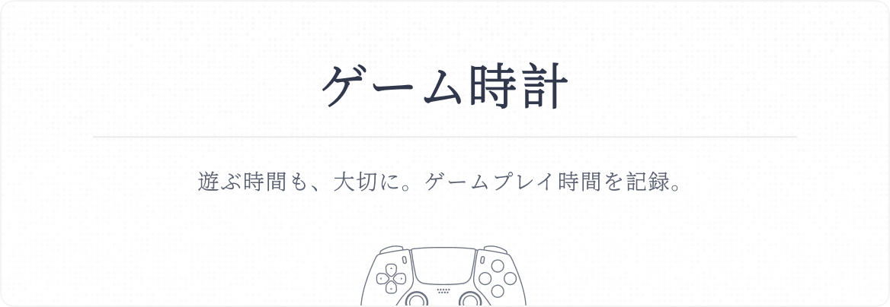

<p align="center">
  
  <br />
  <p align="center">
    <a href="./README.md">English</a>
    | 中文
  </p>
  <br />
</p>

## 📖 项目介绍

使用ゲーム時計追踪和记录你的 PSN 游戏时间。

借助第三方 API 支持，应用将自动获取当前游戏状态和游戏时长，并以图表形式呈现。

## ✨ 特色功能

- 自动追踪并记录指定用户的 PSN 游戏时间
- 以可视化图表展示游戏统计数据（开发中）
- 导出为 JSON 格式的历史游戏记录
- 一键部署并快速启动 Docker 容器

## 🚀 部署指南

### Docker

确保你已安装 Docker，然后运行以下命令启动容器：

```
docker run -d \
  --name=game-tracker \
  -p 4200:4200 \
  -e JWT_SECRET=your_secret_key_here \
  -v $(pwd)/data:/app/data \
  --restart unless-stopped \
  nuthx/game-tracker:latest
```

或使用 Docker Compose 部署：

```
version: "3.8"

services:
  app:
    image: nuthx/game-tracker:latest
    ports:
      - "4200:4200"
    restart: unless-stopped
    environment:
      - JWT_SECRET=your_secret_key_here
    volumes:
      - ./data:/app/data
```

无论以何种方式启动，请在 JWT_SECRET 处填写随机字符串，建议设置 16 位以上的内容。

### 本地部署

请先克隆代码仓库并安装必要依赖：

```
git clone https://github.com/yourusername/game-tracker.git
cd game-tracker
npm install
```

在本地新建一个环境变量 `.env`，并配置 JWT_SECRET 为 16 位以上的随机字符串：

```
JWT_SECRET=your_secret_key_here
```

最后，初始化数据库并启动应用。

```
npx prisma migrate deploy
npm run build
npm run start
```

## 🎮 使用教程

### 1. 获取 NPSSO

在浏览器中访问 [PlayStation](https://www.playstation.com/)，点击"登录"按钮，并使用 PSN 账户登录。

在新的选项卡中打开 [https://ca.account.sony.com/api/v1/ssocookie](https://ca.account.sony.com/api/v1/ssocookie)，浏览器将返回一个 JSON 相应，格式如下：

```
{ "npsso": "<64 character token>" }
```

此处 64 位字符即为你的 NPSSO。

### 2. 添加账号

使用默认账号 `admin` 与密码 `admin` 登录系统，登录状态将在本地 Cookie 中保存 30 天。

在设置中添加你的 NPSSO 并保存，系统会自动更新该用户资料，并在右侧显示头像与 ID 信息。

若拉取失败或用户资料无法显示，请先检查 PSN 的网络连接状况。

### 3. 追踪游戏记录

系统默认追踪登录用户自己的游戏时间。若要追踪其他用户，请在设置中的 PSN 账号处填入待追踪用户的 Account ID。

为降低资源消耗，你还可以调整更长的刷新间隔（默认为 1 分钟）。

## 📝 贡献与反馈

欢迎提交 Pull Request，请确保遵循项目的代码规范和提交规范。

想要添加更多功能，请在 Issues 中提出，将酌情添加。

如遇到程序错误，请在 Issues 中详细描述问题，以便重现和解决问题。

## ⚠️ 免责声明

本项目代码仅供学习交流，不得用于商业用途。
